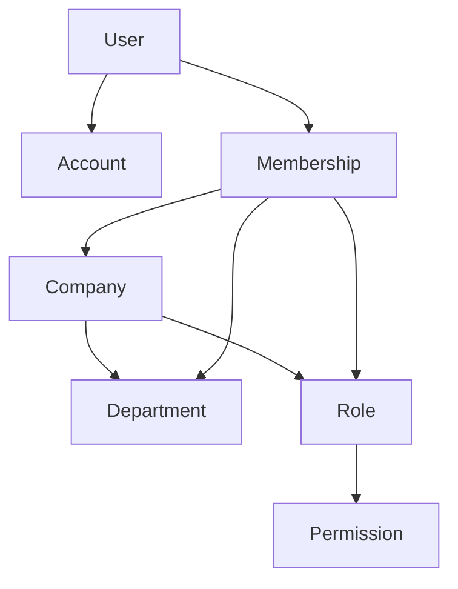
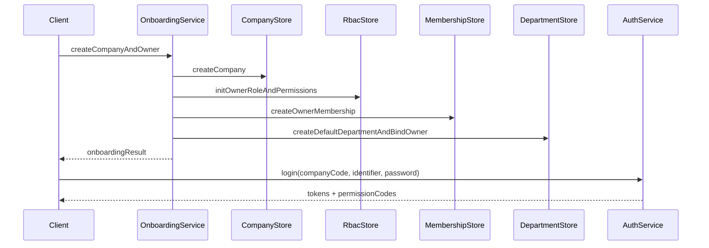

# 公司-部门-员工-角色-帐号-权限关系与流程设计计划

## 目标

- 在不改代码前提下，完成领域关系与入驻开通主流程的细化设计。
- 明确数据约束、状态机、边界校验、权限模型与异常分支。
- 形成后续实现可直接照做的接口与事务边界清单。

## 现状基线（基于当前代码）

- 关系基线来自数据库 schema：
  - `[/Users/liuguoping/code/TimERP/apps/server/src/database/schema/companies.schema.ts](/Users/liuguoping/code/TimERP/apps/server/src/database/schema/companies.schema.ts)`
  - `[/Users/liuguoping/code/TimERP/apps/server/src/database/schema/memberships.schema.ts](/Users/liuguoping/code/TimERP/apps/server/src/database/schema/memberships.schema.ts)`
  - `[/Users/liuguoping/code/TimERP/apps/server/src/database/schema/departments.schema.ts](/Users/liuguoping/code/TimERP/apps/server/src/database/schema/departments.schema.ts)`
  - `[/Users/liuguoping/code/TimERP/apps/server/src/database/schema/membership-departments.schema.ts](/Users/liuguoping/code/TimERP/apps/server/src/database/schema/membership-departments.schema.ts)`
  - `[/Users/liuguoping/code/TimERP/apps/server/src/database/schema/rbac.schema.ts](/Users/liuguoping/code/TimERP/apps/server/src/database/schema/rbac.schema.ts)`
  - `[/Users/liuguoping/code/TimERP/apps/server/src/database/schema/auth.schema.ts](/Users/liuguoping/code/TimERP/apps/server/src/database/schema/auth.schema.ts)`
- 流程基线来自服务实现：
  - `[/Users/liuguoping/code/TimERP/apps/server/src/modules/system-bootstrap/system-bootstrap.service.ts](/Users/liuguoping/code/TimERP/apps/server/src/modules/system-bootstrap/system-bootstrap.service.ts)`
  - `[/Users/liuguoping/code/TimERP/apps/server/src/modules/auth/auth.service.ts](/Users/liuguoping/code/TimERP/apps/server/src/modules/auth/auth.service.ts)`
  - `[/Users/liuguoping/code/TimERP/apps/server/src/modules/department/department.service.ts](/Users/liuguoping/code/TimERP/apps/server/src/modules/department/department.service.ts)`

## 设计输出结构

- 产出 A：统一领域关系定义
  - 实体职责：Company / User / Account / Membership(Employee) / Department / Role / Permission。
  - 关系规则：多对多关系、主部门规则、成员-角色规则、账号归属规则。
  - 一致性约束：同公司约束、跨公司写入禁止、删除策略（cascade/set null/soft delete）。
- 产出 B：入驻开通流程规格（主流程 + 异常分支）
  - 主流程：创建公司 -> 初始化角色与权限 -> 创建首个员工 -> 绑定部门 -> 绑定角色 -> 登录。
  - 异常分支：公司 code 冲突、员工重复、角色缺失、部门循环、权限不足、账号禁用。
  - 事务边界：每一步哪些操作要同事务提交，哪些可异步补偿。
- 产出 C：状态流转定义
  - company.status、membership.status、department.status、user.status、account有效性。
  - 状态迁移触发器与不可逆规则（如离职后登录限制）。
- 产出 D：权限矩阵与鉴权链路
  - 资源动作：`company.*`, `department.*`, `membership.*`, `role.*`, `account.*`。
  - 角色建议：owner/admin/manager/employee。
  - 校验位置：Controller 装饰器 + Service 业务校验双层控制。
- 产出 E：接口契约草案（仅设计）
  - Onboarding API、Employee API、Role API、Department API、Account API 的请求/响应与幂等语义。

## 核心关系与流程图（设计稿）

## 关键细节规则（将写入设计）

- 员工定义：`Membership` 即员工实体，`User` 是跨公司主体。
- 主部门唯一：同一 `membership` 仅允许一个 `isPrimary=true`。
- 同公司强约束：`membership_departments`、`membership_roles`、`departments.manager_membership_id` 必须与 `company_id` 一致。
- 账号策略：`accounts` 仅承载登录方式映射，密码链路保持 `users.passwordHash`（当前方案A）。
- 访问决策：访问权限以 `membershipId + role_permissions` 计算，不直接以 user 全局权限计算。

## 落地优先级（设计到实现的拆解顺序）

1. 先定“关系与约束清单”（避免后续接口反复改）。
2. 再定“入驻开通时序 + 事务边界”。
3. 再定“权限矩阵 + 默认角色模板”。
4. 最后定“接口契约与幂等策略”。

## 验收标准（设计阶段）

- 能回答每个关系的归属与删除语义。
- 能从任一员工推导其公司、部门、角色、权限和可用登录方式。
- 入驻主流程具备成功路径与失败回滚/补偿策略。
- 接口草案覆盖开通、组织调整、权限调整、账号变更的主场景。

