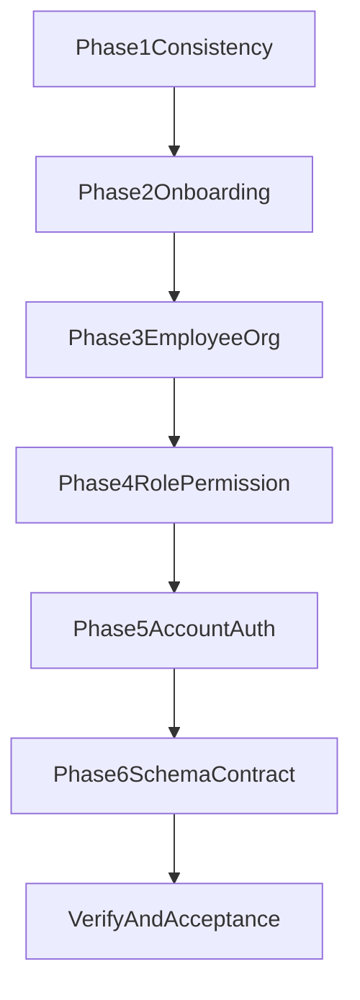

# 组织关系与流程落地计划

## 目标

- 落地公司、部门、员工（membership）、角色、帐号、权限的统一关系与业务流程。
- 打通主链路：公司开通 -> 初始化角色权限 -> 创建员工 -> 分配部门/角色 -> 登录鉴权。
- 保证同公司边界、主部门唯一、权限按 membership 生效。

## 阶段 1：数据一致性约束补齐

- 在 `[/Users/liuguoping/code/TimERP/apps/server/src/database/schema/departments.schema.ts](/Users/liuguoping/code/TimERP/apps/server/src/database/schema/departments.schema.ts)` 补充经理查询索引（`manager_membership_id`）。
- 在 `[/Users/liuguoping/code/TimERP/apps/server/src/database/schema/membership-departments.schema.ts](/Users/liuguoping/code/TimERP/apps/server/src/database/schema/membership-departments.schema.ts)` 增加主部门查询优化索引（`membership_id + is_primary`）。
- 在 `[/Users/liuguoping/code/TimERP/apps/server/drizzle/*.sql](/Users/liuguoping/code/TimERP/apps/server/drizzle)` 增加一致性约束迁移（优先应用层校验 + 必要 FK/索引，避免高风险 CHECK 先行）。
- 在 Service 层统一校验同公司边界：
  - `membership_departments` 的 membership 与 department 同公司。
  - `membership_roles` 的 membership 与 role 同公司。
  - `departments.managerMembershipId` 与 department 同公司。

## 阶段 2：Onboarding 编排服务

- 新增模块：`[/Users/liuguoping/code/TimERP/apps/server/src/modules/onboarding](/Users/liuguoping/code/TimERP/apps/server/src/modules/onboarding)`。
- 新增编排服务 `OnboardingService`：
  - 创建公司。
  - 创建 owner 用户与 owner membership。
  - 创建默认角色与权限绑定。
  - 创建默认部门并绑定 owner 为主部门。
- 新增 `POST /onboarding/companies` 接口（带幂等键）。
- 事务边界：
  - 事务 A：公司 + owner user + owner membership。
  - 事务 B：默认角色 + 权限 + owner 角色绑定。
  - 事务 C：默认部门 + owner 部门绑定。

## 阶段 3：员工组织管理流程

- 新增/扩展员工管理模块（可在新模块或复用 onboarding 后续拆分）：
  - 创建员工（复用 user + membership）。
  - 员工入/出部门。
  - 主部门切换（强制唯一）。
  - 员工状态流转（active/inactive）。
- 复用现有部门模块 `[/Users/liuguoping/code/TimERP/apps/server/src/modules/department](/Users/liuguoping/code/TimERP/apps/server/src/modules/department)` 作为部门管理入口。
- 补充跨公司写入保护与业务错误码（冲突、越权、状态非法）。

## 阶段 4：角色与权限管理流程

- 新增角色管理模块：`[/Users/liuguoping/code/TimERP/apps/server/src/modules/role](/Users/liuguoping/code/TimERP/apps/server/src/modules/role)`。
- 接口能力：
  - 创建/更新角色。
  - 角色权限分配。
  - 员工角色分配/回收。
- 权限模板初始化（owner/admin/manager/employee）在 `[/Users/liuguoping/code/TimERP/apps/server/src/modules/system-bootstrap/system-bootstrap.service.ts](/Users/liuguoping/code/TimERP/apps/server/src/modules/system-bootstrap/system-bootstrap.service.ts)` 与 onboarding 共用一套初始化逻辑。

## 阶段 5：帐号绑定与鉴权闭环

- 在 auth 体系上扩展帐号绑定流程（不改密码来源方案A）：
  - 新增 account 绑定/解绑接口。
  - 维护 `accounts` 登录方式映射。
- 校验鉴权链路：
  - 登录准入按 `user.status + company.status + membership.status`。
  - 授权按 `membership_roles -> role_permissions -> permissions`。
- 相关文件：
  - `[/Users/liuguoping/code/TimERP/apps/server/src/modules/auth/auth.service.ts](/Users/liuguoping/code/TimERP/apps/server/src/modules/auth/auth.service.ts)`
  - `[/Users/liuguoping/code/TimERP/apps/server/src/modules/auth/auth.controller.ts](/Users/liuguoping/code/TimERP/apps/server/src/modules/auth/auth.controller.ts)`
  - `[/Users/liuguoping/code/TimERP/apps/server/src/database/schema/auth.schema.ts](/Users/liuguoping/code/TimERP/apps/server/src/database/schema/auth.schema.ts)`

## 阶段 6：共享 schema 与接口契约收敛

- 在 `[/Users/liuguoping/code/TimERP/packages/schema/src](/Users/liuguoping/code/TimERP/packages/schema/src)` 补齐 onboarding、employee、role、account 的 zod schema 与 type。
- 在 `[/Users/liuguoping/code/TimERP/packages/schema/index.ts](/Users/liuguoping/code/TimERP/packages/schema/index.ts)` 导出新增契约。
- 保持后端 controller 手动 parse + i18n 错误处理风格一致。

## 验证与验收

- 构建验证：`packages/schema`、`apps/server`。
- 关键链路验收：
  - 公司开通成功并生成 owner 初始上下文。
  - 新员工加入后能分配部门/角色且权限生效。
  - 主部门唯一规则可持续保持。
  - 非同公司资源写入全部被拒绝。
- 回归验证：登录、切换公司、权限守卫不回归。

## 执行顺序图

